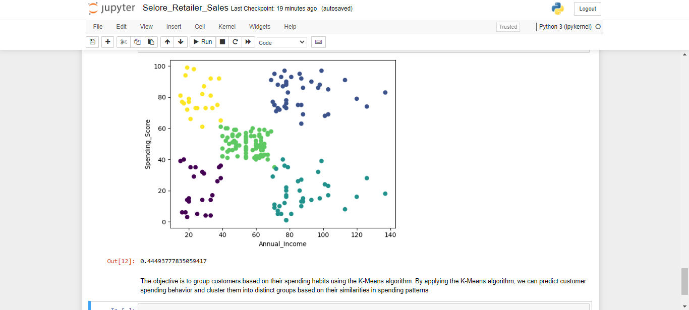
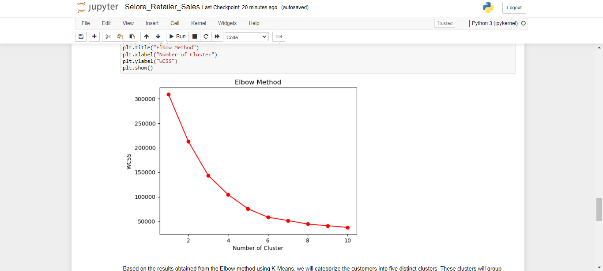
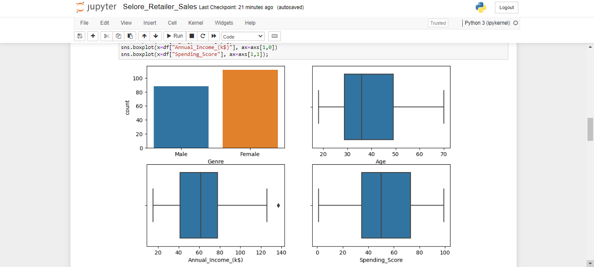

## Selore_Retails

🛍️ Understanding customer behavior is crucial for retail companies, and Selore Retails, a prominent electronics retail chain, recognizes its importance. As a Data Scientist working on this project, I utilized unsupervised learning techniques to build a customer segmentation model based on customer demographics and spending habits.

By analyzing data on customers, including gender, age, annual income, and spending score, I successfully identified distinct groups of customers with similar behavior and characteristics. This segmentation empowers Selore Retails to tailor personalized marketing campaigns, optimize pricing strategies, and offer targeted product recommendations.

With the ability to understand customer segments, Selore Retails can enhance customer satisfaction, increase sales, and solidify its position as a go-to destination for mobile phones and accessories. This data-driven approach will revolutionize the way Selore Retails engages with its customers, establishing it as a leader in the retail industry. 🎯📊

 

 
